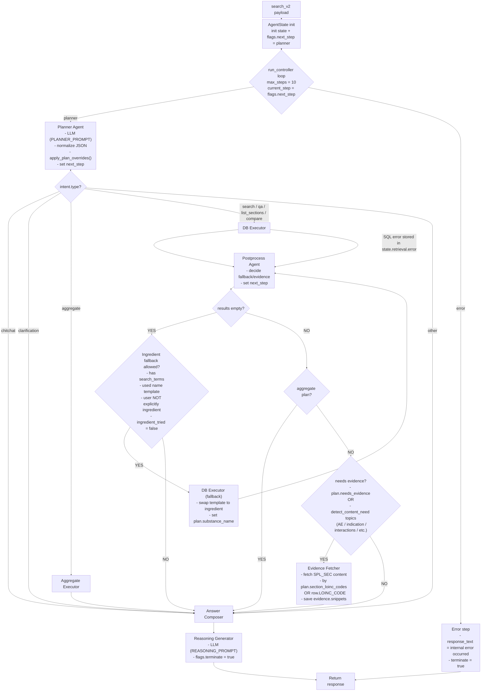

````md
# search_v2 Flow (Controller + State Machine)

## High-level execution path



# “What writes what” (quick mental model)

## Planner (`run_planner`)

**Reads**

* `conversation.user_query`
* `conversation.history`

**Writes**

* `state.intent`
* `state.retrieval.plan`
* `flags.next_step` → `db_executor` / `aggregate_executor` / `answer_composer` / `error`

**Calls**

* `apply_plan_overrides()` *(deterministic)*

---

## DB Executor (`run_db_executor`)

**Reads**

* `state.retrieval.plan`
* `state.intent.slots`

**Writes**

* `state.retrieval.generated_sql`
* `state.retrieval.results` **or** `state.retrieval.error`
* `flags.next_step = postprocess`

---

## Postprocess (`run_postprocess`)

**Reads**

* `state.retrieval.results`
* `state.retrieval.plan`
* `conversation.user_query`

**Writes**

* may modify `state.retrieval.plan`

  * upgrade to `section_content`
  * set `section_loinc_codes`
* may set fallback flags in `state.retrieval.fallback`

**Sets `flags.next_step`**

* `db_executor` *(fallback loop)*
* `evidence_fetcher`
* `answer_composer`

---

## Evidence Fetcher (`run_evidence_fetcher`)

**Reads**

* `state.retrieval.results`
* `state.retrieval.plan.section_loinc_codes`

**Writes**

* `state.evidence.snippets`
* `flags.next_step = answer_composer`

---

## Aggregate Executor (`run_aggregate_executor`)

**Reads**

* `state.retrieval.plan` *(content_query, filters, etc.)*

**Writes**

* `state.retrieval.aggregate`
* `flags.next_step = answer_composer`

---

## Answer Composer (`run_answer_composer`)

**Reads**

* results / snippets / aggregate + `intent.type`

**Writes**

* `state.answer.response_text`
* `flags.next_step = reasoning_generator`

---

## Reasoning Generator (`run_reasoning_generator`)

**Reads**

* `state.trace_log`

**Writes**

* `state.reasoning`
* `flags.terminate = True`
